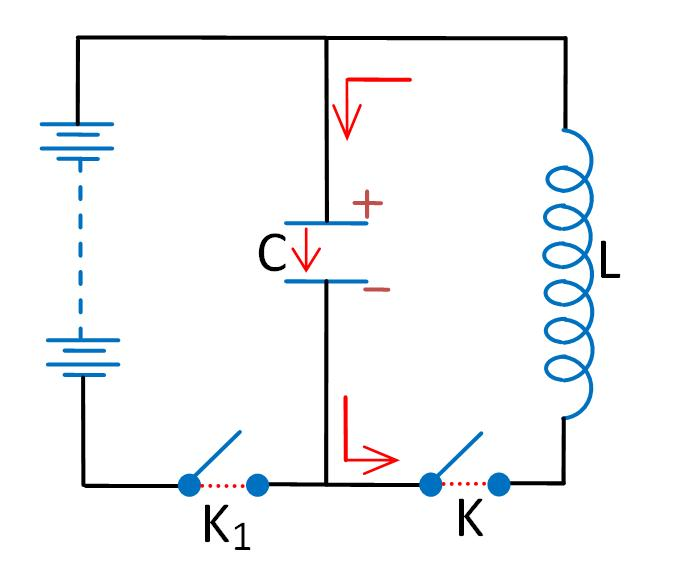
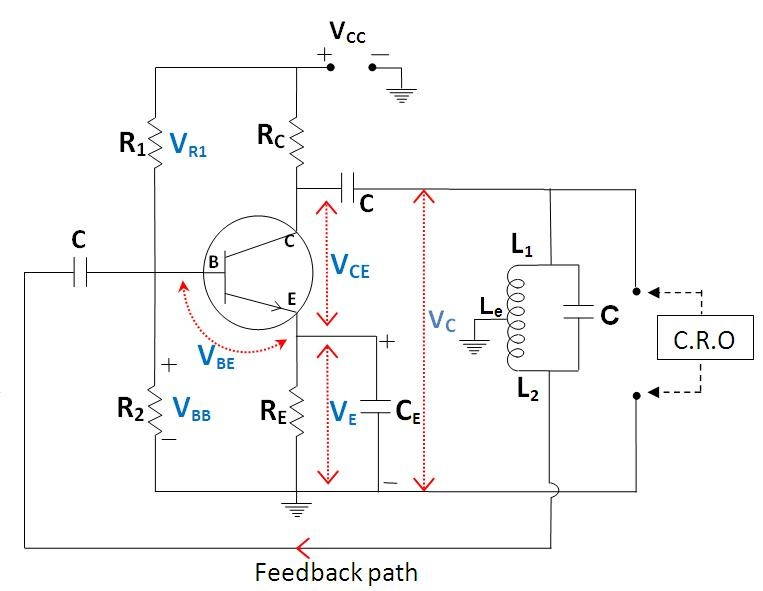
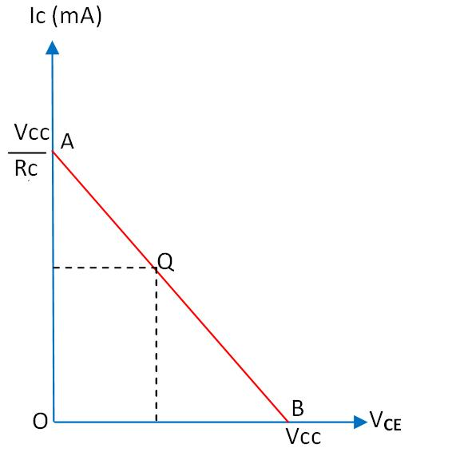
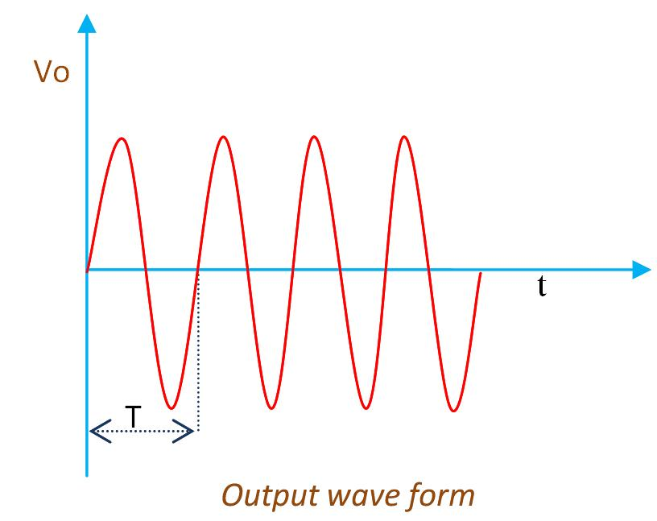

<h2>Theory</h2>

<h4>TANK CIRCUIT</h4>

A circuit which produces electrical oscillations of any desired frequency is known as an oscillatory circuit. A simple oscillatory circuit is one which contains a capacitor C and inductor L placed in parallel as shown.

 

 

When the key K1 is closed, the capacitor C is charged with the upper plate positive and lower plate negative. Now the key K1 is kept open. At this moment, the lower plate has an excess and the upper plate a deficit of electrons. This gives rise to an electric field across the capacitor plates in the direction shown.

When the key K is closed, the capacitor discharges itself through the inductor and there is a flow of electrons as indicated by the arrow head. The current flow sets up a magnetic field around the inductor coil. Due to the inductive effect, the current builds up slowly up to a maximum value which is attained when the capacitor is fully discharged. At that instant, the electrostatic energy is zero but due to maximum current flow, the magnetic field energy around the inductor coil is at maximum.

As the capacitor is fully discharged, the magnetic field starts decreasing. As the magnetic flux linked with the circuit changes, an e.m.f is induced, which makes the current continue to flow. This current recharges the capacitor in the opposite direction, with its upper plate negative and lower plate positive. Finally, the magnetic field fully collapses. At this stage, the magnetic field energy is zero and electrostatic energy is again at maximum.

As soon as the magnetic field is zero, the capacitor which is fully recharged begins to discharge, causing the current to flow in the opposite direction, and a magnetic field is again set up around the inductor coil. The magnetic field energy becomes a maximum when the electric field energy is zero.

<h4>HARTLEY OSCILLATOR</h4>

Hartley Oscillator is a device that generates oscillatory output (sinusoidal). It consists of an amplifier linked to an oscillatory circuit, also called an LC circuit or tank circuit. The function of the tank circuit is to tune a certain frequency.

LC oscillators are designed to operate in the radio-frequency range. Its inductance will be in microhenries. However, they can also be designed to produce oscillations in the low audio-frequency range. But for low-frequency operation, the inductors used will be very large in value (i.e., in millihenries) and hence very large in physical size.

The circuit oscillates when the components are suitably selected to satisfy the Barkhausen criterion:

<strong>βA = +1</strong> (feedback factor must be unity)

There must also be a positive feedback, where <strong>A</strong> is the open-loop gain and <strong>β</strong> is the feedback ratio.

In a Hartley oscillator, the feedback voltage is across L2 and the output voltage is across L1.

Feedback ratio 

$$\beta = \frac{V_2}{V_1} = \frac{X_{L2}}{X_{L1}} = \frac{L_2 \omega}{L_1 \omega} = \frac{L_2}{L_1}$$

The frequency of oscillation is given by $f=\frac{1}{2\pi \sqrt{L_eC}}$

Where <strong>Le</strong> is the effective inductance of the coil L1 and L2, given by:

<strong>Le = L1 + L2</strong>

For faithful amplification, a transistor amplifier must satisfy three basic conditions, namely: 

<ol>
  <li>Proper zero signal collector current,</li>
  <li>Proper base-emitter voltage at any instant, and</li>
  <li>Proper collector-emitter voltage at any instant.</li>
</ol>

Fulfilment of these conditions is known as <strong>transistor biasing</strong>. One method of obtaining transistor biasing is by the potential divider arrangement.

The circuit consists of a potential divider arrangement. R1 and R2 form a potential divider across VCC. The voltage drop VR2 across R2 forward-biases the emitter, whereas the VCC supply reverse-biases the collector.

As per the voltage divider theorem (Fig 1),

$$V_{R2} = \frac{V_{CC} R_2}{R_1 + R_2}$$

$\text{As seen,}$
$$V_E = V_{R2} - V_{BE}$$

$\text{So,}$
$$I_B = \frac{V_{R2} - V_{BE}}{R_B + (1 + \beta) R_E}$$

$$I_C = \beta I_B \quad \text{and} \quad I_E = (1 + \beta) I_B$$

$\text{Also,}$
$$V_C = V_{CC} - I_C R_C$$

$$V_{CE} = V_C - V_E = V_{CC} - I_C R_C - I_E R_E$$

 

 

This value of <strong>IC</strong> and <strong>VCE</strong> gives the <strong>Q point</strong>, also called the <em>DC operating point</em> or <em>working point</em>. It is called the operating point because the variations of <strong>IC</strong> and <strong>VCE</strong> take place about this point when a signal is applied.

It is also called the <em>quiescent (silent) point</em> or <strong>Q point</strong> because it is the point on the <strong>IC–VCE</strong> characteristics when the transistor is silent, i.e., in the absence of a signal.

<h3>WORKING</h3>

When the supply is switched on, a voltage <strong>V1</strong> is developed across <strong>L1</strong> and <strong>V2</strong> across <strong>L2</strong>. <strong>V1</strong> is the oscillator output. There is a phase difference of 180° between the voltages of <strong>L1</strong> and <strong>L2</strong>. The voltage across <strong>L2</strong> (<strong>V2</strong>) is given as the feedback signal.

Since the amplifier is in CE configuration, it produces a phase difference of 180°. Therefore, the amplifier and the feedback network together produce a total phase difference of 360°, i.e., a positive feedback is achieved, and the circuit works as an oscillator.

Once energy is supplied to the tank circuit, the cycle begins. The capacitor stores energy in its electric field whenever there is a potential difference across its plates. As the current begins to flow out of the capacitor and into the inductor, a magnetic field builds up around the coil.

The capacitor loses its energy, and current will continue to flow in the inductor caused by the effect of the energy in the magnetic field. This current will start to send current back into the capacitor in the reverse direction. The cycle then repeats, over and over, at a period (frequency) that is determined by the values of the inductor and the capacitor.

The frequency of oscillation is given by: 

$$f=\frac{1}{2\pi \sqrt{LC}}$$

This is the output waveform.

 

